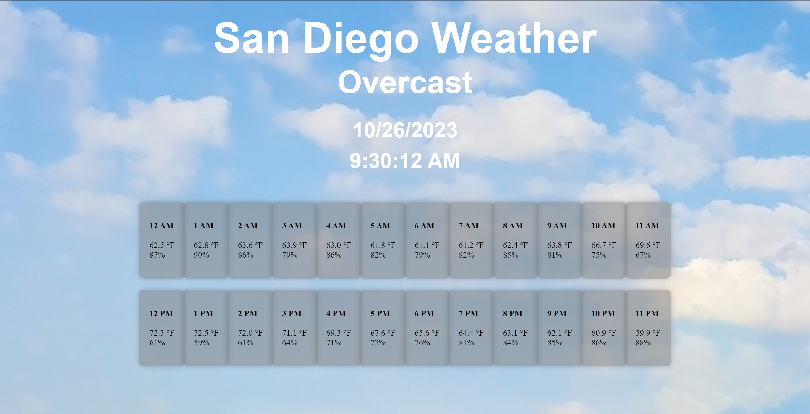

<html lang="en">
<head>
    <meta charset="UTF-8">
    <meta name="viewport" content="width=device-width, initial-scale=1.0">
    <title>CSS Layout Page</title>

</head>

<body>
    

      
    

    

      
    

    

      
    

    
Recipe of the Day

    
Search Bar for Recipe

</body>
</html>