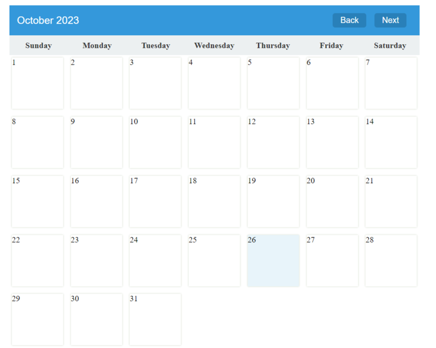

<html lang="en">
<head>
    <meta charset="UTF-8">
    <meta name="viewport" content="width=device-width, initial-scale=1.0">
    <title>All in One</title>

  
</head>

<body>
    <header>
        <h1>All in One</h1>
    </header>

  

        

            
        

        

            
        

        

            
        

        

            <h2>Recipe of the Day</h2>
        

        

            <h2>Search Bar for Recipe</h2>
        

    

</body>
</html>